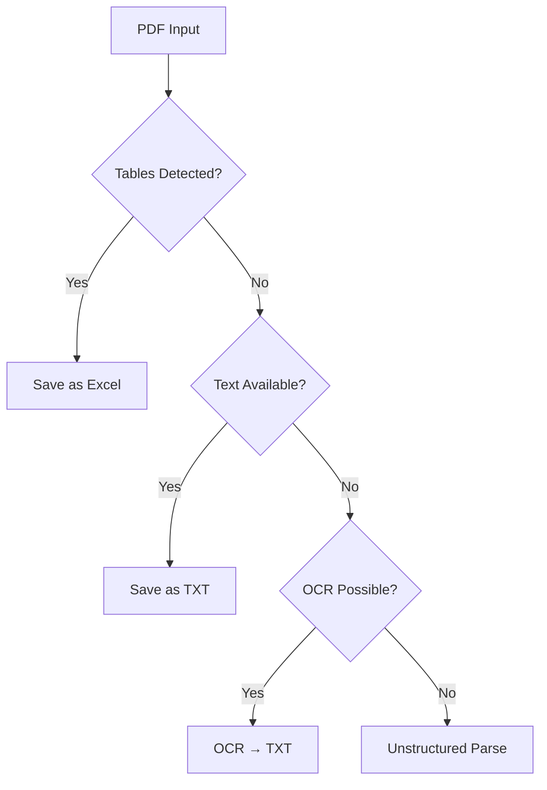

# 📄 PDF Content Extractor


> A comprehensive Python tool for extracting text, tables, and images from PDF files with intelligent auto-detection and async processing capabilities.

## ✨ Features

- 🔍 **Multi-method text extraction** - pdfplumber, OCR (Tesseract), and unstructured parsing
- 📊 **Advanced table extraction** - Camelot with stream and lattice flavors  
- 🖼️ **Image extraction** - Extract embedded images with PyMuPDF
- 📁 **Multiple output formats** - TXT, CSV, JSON, Excel (XLSX)
- 🤖 **Intelligent auto-detection** - Automatically chooses the best extraction method
- ⚡ **Async processing** - Process multiple PDFs concurrently
- 🛡️ **Robust error handling** - Graceful fallbacks when methods fail

## 🚀 Quick Start

```python
from pdf_extractor import extract_from_pdf

# Extract everything automatically
result = extract_from_pdf("document.pdf", method="auto")
print(result)
```

## 📦 Installation

### Prerequisites

<details>
<summary>🔧 System Dependencies</summary>

**Tesseract OCR:**
```bash
# Ubuntu/Debian
sudo apt-get install tesseract-ocr

# macOS
brew install tesseract

# Windows - Download from: https://github.com/UB-Mannheim/tesseract/wiki
```

**Poppler (for PDF to image conversion):**
```bash
# Ubuntu/Debian
sudo apt-get install poppler-utils

# macOS
brew install poppler

# Windows - Download poppler binaries and add to PATH
```
</details>

### Python Dependencies

```bash
pip install PyMuPDF pdfplumber camelot-py[cv] pytesseract pdf2image unstructured[pdf] pandas openpyxl
```

Or create a `requirements.txt`:
```txt
PyMuPDF>=1.23.0
pdfplumber>=0.9.0
camelot-py[cv]>=0.10.0
pytesseract>=0.3.10
pdf2image>=3.1.0
unstructured[pdf]>=0.10.0
pandas>=1.5.0
openpyxl>=3.1.0
```

## 📖 Usage

### Basic Examples

```python
# 🤖 Auto-detect best method (recommended)
result = extract_from_pdf("document.pdf", method="auto")

# 📝 Extract text only
result = extract_from_pdf("document.pdf", method="txt")

# 📊 Extract tables as Excel
result = extract_from_pdf("report.pdf", method="excel")

# 🗂️ Extract tables as CSV
result = extract_from_pdf("data.pdf", method="csv")

# 🌐 Extract tables as JSON
result = extract_from_pdf("tables.pdf", method="json")
```

### Async Processing (Multiple PDFs)

```python
import asyncio
from pdf_extractor import process_pdf_async

async def process_multiple():
    pdf_files = ["doc1.pdf", "doc2.pdf", "doc3.pdf"]
    tasks = [process_pdf_async(file, method="auto") for file in pdf_files]
    results = await asyncio.gather(*tasks)
    return results

# Run
results = asyncio.run(process_multiple())
```

### Run the Example Script

```python
python pdf_extractor.py
```

## 🎯 Extraction Methods

| Method | Description | Best For |
|--------|-------------|----------|
| `auto` | 🤖 Intelligent detection | **Recommended** - Unknown PDF types |
| `txt` | 📝 Text extraction only | Documents with readable text |
| `csv` | 📊 Tables → CSV | Structured data extraction |
| `json` | 🌐 Tables → JSON | API/data processing |
| `excel` | 📈 Tables → Excel files | Data analysis workflows |
| `unstructured` | 🔍 Advanced parsing | Complex layouts, mixed content |

### Auto Method Logic



## 📁 Output Structure

```
extracted_output/
├── 📄 document.txt                 # Extracted text
├── 📊 document_tables.csv         # All tables (CSV)
├── 🌐 document_tables.json        # All tables (JSON)
├── 📈 document_table_1.xlsx       # Individual tables
├── 📈 document_table_2.xlsx
├── 🖼️ document_page1_img1.png     # Extracted images
└── 🔍 document_structured.txt     # Structured parsing
```

## ⚙️ API Reference

### `extract_from_pdf(file_path, method="auto", output_folder="extracted_output")`

**Parameters:**
- `file_path` (str): Path to PDF file
- `method` (str): Extraction method (`auto`, `txt`, `csv`, `json`, `excel`, `unstructured`)
- `output_folder` (str): Output directory path

**Returns:**
- `str`: Success message with file paths

**Raises:**
- `ValueError`: When no content found or invalid method

### `process_pdf_async(file_path, method="auto", output_folder="extracted_output")`

Async wrapper for `extract_from_pdf()` - same parameters and returns.

## 🐛 Troubleshooting

<details>
<summary>❌ "No tables found for CSV export"</summary>

**Cause:** PDF doesn't contain detectable tables  
**Solution:** Try `method="auto"` or `method="txt"`
</details>

<details>
<summary>⏱️ OCR is very slow</summary>

**Cause:** Large scanned documents  
**Solution:** Use `method="txt"` first, or process smaller sections
</details>

<details>
<summary>🔍 "Tesseract not found"</summary>

**Cause:** Tesseract not in system PATH  
**Solution:**
```python
# Add this before importing pytesseract
import pytesseract
pytesseract.pytesseract.tesseract_cmd = r'C:\Program Files\Tesseract-OCR\tesseract.exe'  # Windows
```
</details>

<details>
<summary>📦 Import errors</summary>

**Cause:** Missing dependencies  
**Solution:**
```bash
# Install with all extras
pip install camelot-py[cv] unstructured[pdf]

# Ubuntu additional packages
sudo apt-get install python3-tk ghostscript
```
</details>

## 🔧 Platform-Specific Setup

<details>
<summary>🐧 Ubuntu/Debian</summary>

```bash
# System dependencies
sudo apt-get update
sudo apt-get install tesseract-ocr poppler-utils python3-tk ghostscript

# Python packages
pip install -r requirements.txt
```
</details>

<details>
<summary>🍎 macOS</summary>

```bash
# Using Homebrew
brew install tesseract poppler

# Python packages
pip install -r requirements.txt
```
</details>

<details>
<summary>🪟 Windows</summary>

1. Install [Tesseract](https://github.com/UB-Mannheim/tesseract/wiki)
2. Install [Poppler](https://github.com/oschwartz10612/poppler-windows/releases/)
3. Add both to system PATH
4. Install Python packages: `pip install -r requirements.txt`
</details>

## 📊 Performance & Tips

- ⚡ **Use async** for multiple files
- 🎯 **Specify method** if you know content type  
- 💾 **Monitor memory** with large PDFs
- 📁 **Separate output folders** to avoid conflicts

## 🤝 Contributing

1. 🍴 Fork the repository
2. 🌿 Create feature branch (`git checkout -b feature/amazing-feature`)
3. ✅ Add tests for new functionality
4. 🔧 Ensure all tests pass
5. 📝 Commit changes (`git commit -m 'Add amazing feature'`)
6. 📤 Push to branch (`git push origin feature/amazing-feature`)
7. 🔄 Open Pull Request

## 📄 License

This project is licensed under the MIT License - see the [LICENSE](LICENSE) file for details.

## 🙏 Acknowledgments

- [**PyMuPDF**](https://pymupdf.readthedocs.io/) - PDF processing and image extraction
- [**pdfplumber**](https://github.com/jsvine/pdfplumber) - Text extraction
- [**Camelot**](https://camelot-py.readthedocs.io/) - Table extraction
- [**Tesseract**](https://github.com/tesseract-ocr/tesseract) - OCR capabilities
- [**unstructured**](https://unstructured-io.github.io/unstructured/) - Advanced document parsing

---

<div align="center">

**⭐ Star this repo if it helped you!**

[Report Bug](../../issues) · [Request Feature](../../issues) · [Documentation](../../wiki)

</div>
